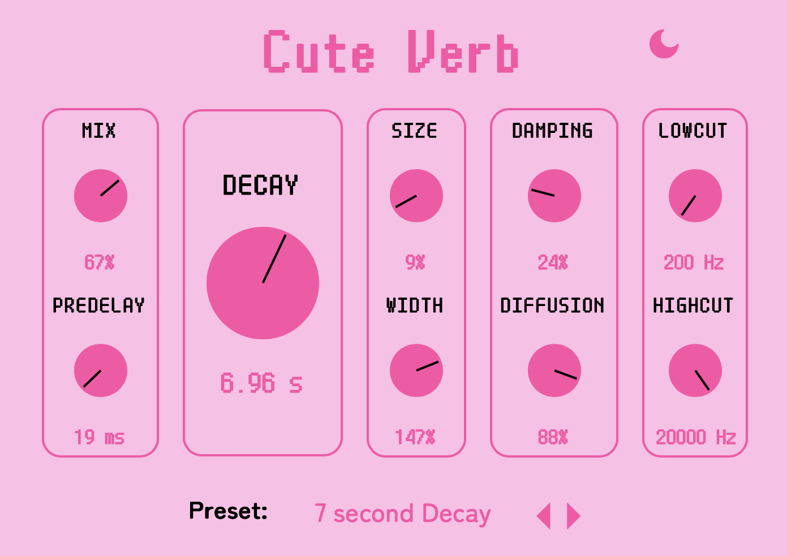

# Cute Verb

Cute Verb is a VST plugin for reverb (hall reflection) effects.

### Controls:
- Mix - The amount of the effect applied.
- Predelay - Time to delay the reverb in ms.
- Decay - Time it takes for the reverb to decay in s.
- Size - How big/intense the reverb sounds.
- Width - The stereo width of the reverb.
- Damping - Accentuates the lowpass filter in the comb filter feedback loop, lower is brighter and higher is softer.
- Diffusion - The feedback of the allpass filters, lower sounds closer and higher sounds farther and more diffuse. 
- Lowcut - Applies a highpass filter to the reverbed signal.
- Highcut - Applies a lowpass filter to the reverbed signal.

The reverb sounds... passable, although it might sound too much like comb filters. I might improve the algorithm 
in the future but it's a simple implementation of comb filters fed into allpass filters

### Design

Our design is available here: https://www.figma.com/design/r7YWyrGmRyQdxd6UXErWNV/Cute-Delay

### Purchase

### See Also

- [Cute Delay](https://github.com/Moebytes/Cute-Delay) 
- [Cute Filer](https://github.com/Moebytes/Cute-Filer)